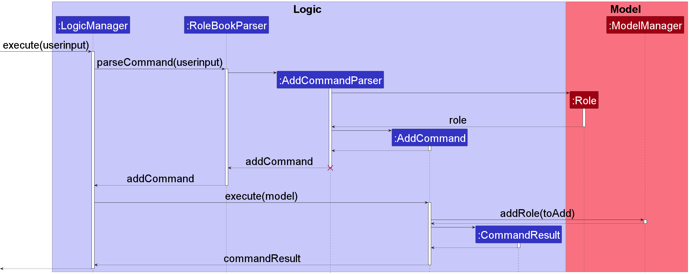
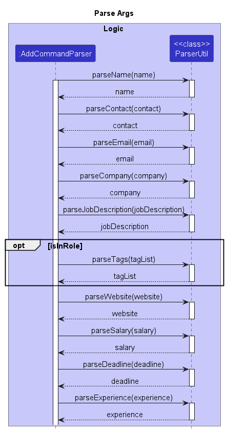
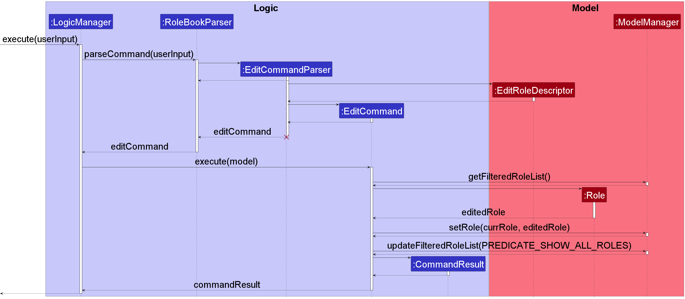
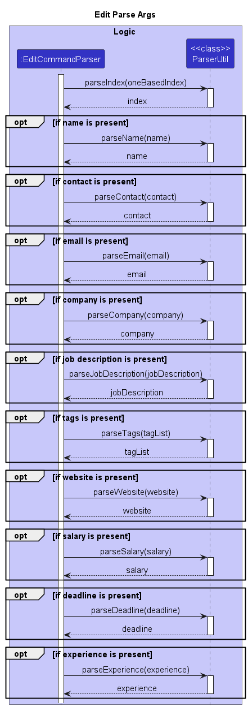
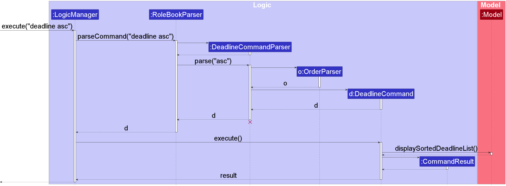
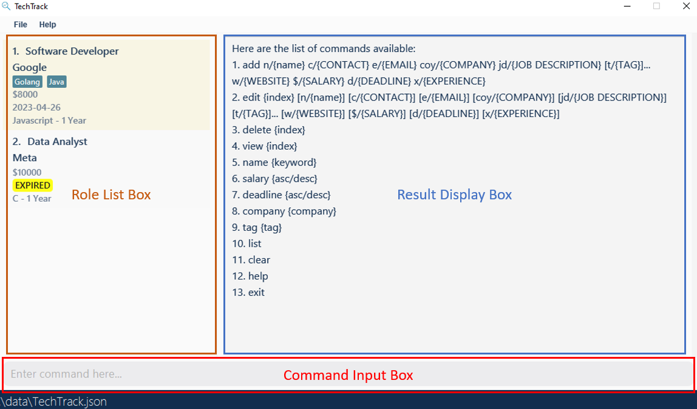
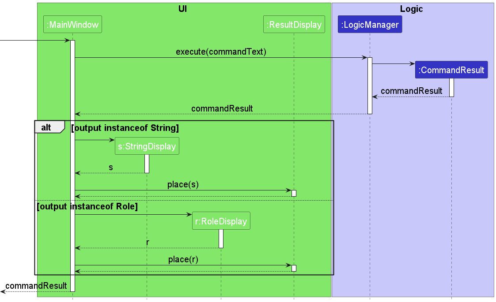

* Table of Contents
{:toc}

--------------------------------------------------------------------------------------------------------------------
## **Introduction**

{{ site.data.techtrack.about.summary }}

### Technologies

The TechTrack software application is developed using Java 11 and employs JavaFX for constructing its graphical user
interface.
Gradle serves as the project management and build tool. JUnit is utilized for conducting software testing.

### Features

### Functions

--------------------------------------------------------------------------------------------------------------------

## **Acknowledgements**

This project is based on the AddressBook-Level3 project created by the [SE-EDU initiative](https://se-education.org).

Third-party software used in this project:

* [Gradle](https://gradle.org/)
* [CheckStyle](https://checkstyle.sourceforge.io/)
* [Codecov](https://codecov.io/)
* [JavaFx](https://openjfx.io/)
* [JUnit](https://junit.org/)

--------------------------------------------------------------------------------------------------------------------

## **Setting up, getting started**

Refer to the guide [_Setting up and getting started_](SettingUp.md).

--------------------------------------------------------------------------------------------------------------------

## **Design**

:bulb: **Tip:** The `.puml` files used to create diagrams in this document can be found in
the [diagrams](https://github.com/AY2223S2-CS2103-W16-2/tp/tree/master/docs/diagrams/) folder. Refer to the [_PlantUML
Tutorial_ at se-edu/guides](https://se-education.org/guides/tutorials/plantUml.html) to learn how to create and edit
diagrams.

### Architecture

The ***Architecture Diagram*** given above explains the high-level design of the App.

Given below is a quick overview of main components and how they interact with each other.

**Main components of the architecture**

**`Main`** has two classes
called [`Main`](https://github.com/AY2223S2-CS2103-W16-2/tp/tree/master/src/main/java/seedu/techtrack/Main.java)
and [`MainApp`](https://github.com/AY2223S2-CS2103-W16-2/tp/tree/master/src/main/java/seedu/techtrack/MainApp.java). It
is responsible for,

* At app launch: Initializes the components in the correct sequence, and connects them up with each other.
* At shut down: Shuts down the components and invokes cleanup methods where necessary.

[**`Commons`**](#common-classes) represents a collection of classes used by multiple other components.

The rest of the App consists of four components.

* [**`UI`**](#ui-component): The UI of the App.
* [**`Logic`**](#logic-component): The command executor.
* [**`Model`**](#model-component): Holds the data of the App in memory.
* [**`Storage`**](#storage-component): Reads data from, and writes data to, the hard disk.

**How the architecture components interact with each other**

The *Sequence Diagram* below shows how the components interact with each other for the scenario where the user issues
the command `delete 1`.

Each of the four main components (also shown in the diagram above),

* defines its *API* in an `interface` with the same name as the Component.
* implements its functionality using a concrete `{Component Name}Manager` class (which follows the corresponding
  API `interface` mentioned in the previous point.

For example, the `Logic` component defines its API in the `Logic.java` interface and implements its functionality using
the `LogicManager.java` class which follows the `Logic` interface. Other components interact with a given component
through its interface rather than the concrete class (reason: to prevent outside component's being coupled to the
implementation of a component), as illustrated in the (partial) class diagram below.

The sections below give more details of each component.

### UI component

The **API** of this component is specified
in [`Ui.java`](https://github.com/AY2223S2-CS2103-W16-2/tp/tree/master/src/main/java/seedu/techtrack/ui/Ui.java)

The UI consists of a `MainWindow` that is made up of parts e.g.`CommandBox`, `ResultDisplay`, `RoleListPanel`
, `StatusBarFooter` etc. All these, including the `MainWindow`, inherit from the abstract `UiPart` class which captures
the commonalities between classes that represent parts of the visible GUI.

The `UI` component uses the JavaFx UI framework. The layout of these UI parts are defined in matching `.fxml` files that
are in the `src/main/resources/view` folder. For example, the layout of
the [`MainWindow`](https://github.com/AY2223S2-CS2103-W16-2/tp/tree/master/src/main/java/seedu/techtrack/ui/MainWindow.java)
is specified
in [`MainWindow.fxml`](https://github.com/AY2223S2-CS2103-W16-2/tp/tree/master/src/main/resources/view/MainWindow.fxml)

The `UI` component,

* executes user commands using the `Logic` component.
* listens for changes to `Model` data so that the UI can be updated with the modified data.
* keeps a reference to the `Logic` component, because the `UI` relies on the `Logic` to execute commands.
* depends on some classes in the `Model` component, as it displays `Role` object residing in the `Model`.

### Logic component

**API** : [`Logic.java`](https://github.com/AY2223S2-CS2103-W16-2/tp/tree/master/src/main/java/seedu/techtrack/logic/Logic.java)

Here's a (partial) class diagram of the `Logic` component:

How the `Logic` component works:

1. When `Logic` is called upon to execute a command, it uses the `RoleBookParser` class to parse the user command.
1. This results in a `Command` object (more precisely, an object of one of its subclasses e.g., `AddCommand`) which is
   executed by the `LogicManager`.
1. The command can communicate with the `Model` when it is executed (e.g. to add a role).
1. The result of the command execution is encapsulated as a `CommandResult` object which is returned from `Logic`.

The Sequence Diagram below illustrates the interactions within the `Logic` component for the `execute("delete 1")` API
call.

:information_source: **Note:** The lifeline for `DeleteCommandParser` should end at the destroy marker (X) but due to a limitation of PlantUML, the lifeline reaches the end of diagram.

Here are the other classes in `Logic` (omitted from the class diagram above) that are used for parsing a user command:

How the parsing works:

* When called upon to parse a user command, the `RoleBookParser` class creates an `XYZCommandParser` (`XYZ` is a
  placeholder for the specific command name e.g., `AddCommandParser`) which uses the other classes shown above to parse
  the user command and create a `XYZCommand` object (e.g., `AddCommand`) which the `RoleBookParser` returns back as
  a `Command` object.
* All `XYZCommandParser` classes (e.g., `AddCommandParser`, `DeleteCommandParser`, ...) inherit from the `Parser`
  interface so that they can be treated similarly where possible e.g, during testing.

### Model component

**API** : [`Model.java`](https://github.com/AY2223S2-CS2103-W16-2/tp/tree/master/src/main/java/seedu/techtrack/model/Model.java)

The `Model` component,

* stores the role book data i.e., all `Role` objects (which are contained in a `UniqueRoleList` object).
* stores the currently 'selected' `Role` objects (e.g., results of a search query) as a separate _filtered_ list which
  is exposed to outsiders as an unmodifiable `ObservableList<Role>` that can be 'observed' e.g. the UI can be bound to
  this list so that the UI automatically updates when the data in the list change.
* stores a `UserPref` object that represents the user’s preferences. This is exposed to the outside as
  a `ReadOnlyUserPref` objects.
* does not depend on any of the other three components (as the `Model` represents data entities of the domain, they
  should make sense on their own without depending on other components)

:information_source: **Note:** An alternative (arguably, a more OOP) model 
is given below. It has a `Tag` list in the `RoleBook`, which `Role` references. This allows `RoleBook` to only require one 
`Tag` object per unique tag, instead of each `Role` needing their own `Tag` objects. 

### Storage component

**API** : [`Storage.java`](https://github.com/AY2223S2-CS2103-W16-2/tp/tree/master/src/main/java/seedu/techtrack/storage/Storage.java)

The `Storage` component,

* can save both role book data and user preference data in json format, and read them back into corresponding
  objects.
* inherits from both `RoleBookStorage` and `UserPrefStorage`, which means it can be treated as either one (if only
  the functionality of only one is needed).
* depends on some classes in the `Model` component (because the `Storage` component's job is to save/retrieve objects
  that belong to the `Model`)

### Common classes

Classes used by multiple components are in the `seedu.RoleBook.commons` package.

--------------------------------------------------------------------------------------------------------------------

## **Implementation**

This section describes some noteworthy details on how certain features are implemented.

### Add Command

The `add` command is used to create a new role in the app and set the necessary fields for that role,
namely they are the: `Name`, `Contact`, `Email`, `Company`, `Job Description`, `Tag`, `Website`, `Salary`, `Deadline`,
`Experience` fields. Note that the `Tag` field is not necessary, while the rest of the fields are necessary for the
command to work.

The format for the `add` command can be
seen [here](https://ay2223s2-cs2103-w16-2.github.io/tp/UserGuide.html#adding-a-role-add).

When `add ...` string is inputted, the UI calls the `LogicManager`. `LogicManager` then calls the `RoleBookParser` to
parse the
input. An instance of the `AddCommandParser` to parse the `args` is created through the respective static
`ParserUtil` functions. In addition, if duplicate parameters are inputted (e.g. `add n/John n/Tom`), only the last
instance is taken,
similar to how [`edit`](#edit-command) are executed.

The `AddCommandParser` will then create the corresponding `Role` object, parsing to a `AddCommand` object it
creates and returns. The `LogicManager` then executes the `AddCommand`, which adds the `Role` to the model.

The following sequence diagram shows how the `add` command works:

The following sequence diagram shows how the argument parsing for the `add` command works:

### Edit Command

The `edit` command is used to change the information of an existing patient in the app. The fields supported are:
`Name`, `Contact`, `Email`, `Company`, `JobDescription`,`Tag`, `Website`, `Salary`,
`Deadline` and `Experience`. Note that the `Tag` field can be inputted with multiple tags (`t/java t/python`) while the
rest does not.

The format for the `edit` command can be
seen [here](https://ay2223s2-cs2103-w16-2.github.io/tp/UserGuide.html#editing-a-role-edit).

When `edit INDEX ...` string is inputted, the UI calls the `LogicManager`. `LogicManager` then calls
the `RoleBookParser` to parse the
input. An instance of the `EditCommandParser` to parse the `INDEX` and `args` is created through the respective static
`ParserUtil` functions. In addition, if duplicate parameters are inputted (e.g. `add n/John n/Tom`), only the last
instance is taken,
similar to how [`add`](#add-command) are executed.

The `EditCommandParser` will then create the corresponding `EditRoleDescriptor` object, parsing it to a
`EditCommand` object it creates and returns. The `LogicManager` then executes the `EditCommand`, which creates a
`Role` from the `EditRoleDescriptor` provided and updates the model with this new `Role`.

The following sequence diagram shows how the `edit` command works:

The following sequence diagram shows how the argument parsing for the `edit` command works:

### Salary and Deadline Command Feature

The `salary` command feature is designed to enable the user to sort the roles based on the salaries in either ascending
or descending order.

When the user launches the application for the first time, the RoleBook is initialized with the current role book from
the storage and loads it. The user can then choose to use it by executing either the `salary asc` command to sort
the salaries in ascending order or `salary desc` command to sort the salaries in descending order.

The format accepted by the `salary` command is `salary ORDER` where `ORDER` have to be either `asc` or `desc`.

When `salary ORDER` is inputted, the UI calls the `LogicManager` which then calls the `RoleBookParser` to parse the
input. This then creates an instance of the `SalaryCommandParser` to parse the `ORDER` of `parseOrder`from `ParserUtil`.
If any of the inputs formats are invalid, a `ParseException` will be thrown.

The `SalaryCommandParser` then creates a `SalaryCommand` which will use operations in the `Model` interface
as `Model#displaySortedSalaryList()` to sort the roles based on the salary of the given `ORDER`.

The `deadline` command implementation is similar to `salary` command by replacing `deadline` with `salary` in the
command line to achieve the sorting of roles based on the deadline of the given `ORDER`.

E.g.: Executing `deadline asc` will sort the roles from the earliest deadline to the latest deadline and vice versa for
`deadline desc`.

The following sequence diagram shows how the `salary` command works:

The following sequence diagram shows how the `deadline` command works:

#### Design considerations:

**Aspect: How `salary` and `deadline` Command executes:**

* **Alternative 1 (current choice):** Sort `salary` or `deadline` of the roles in asc/desc.
    * Pros: Easy to implement.
    * Cons: More CLI needs to be added if more attributes are needed to sort.

* **Alternative 2:** One sort command with the given attribute.
    * Pros: Easy CLI for the user to use.
    * Cons: Can be harder to implement and debug if more attributes are being sorted.

#### Limitations:

The sorting algorithm for `salary` and `deadline` will sort based on the order given. This will sort the current and old
view of the roles.

E.g.: filtering the roles based on name, tag and applying this command `salary asc/desc` or `deadline asc/desc`
will sort both views.

### Company Command Feature

The proposed Company Command feature allows the user to filter companies based on a given keyword. This enables the
user to filter the job list by company which shows all roles pertaining to a certain company.

The feature uses operations in the `Model` interface as `Model#updateFilteredRoleList()`.

Given below is an example usage of how CompanyCommand is being used in the following steps.

1. The user launches the application for the first time. The `RoleBook` will be initialized with the
   current role book.

2. The user can choose to use the `Company Command` to filter companies.
    - The user executes `company <keyword>` command to filter roles with the given company.

The following sequence diagram shows how the `company` command works:

#### Design considerations:

**Aspect: How Company Command executes:**

* **Alternative 1 (current choice):** Filter roles that contain the keyword in the company field.
    * Pros: Easy to implement.
    * Cons: More CLI arguments need to be added if more attributes are needed to filter the list.

* **Alternative 2 (alternative choice):** Filter roles by extending a generic find command.
    * Pros: Less confusing for the user, as all filtering will be done using a single command. e.g. find c/Google
    * Cons: Harder to implement, and the addition of multiple parameters may be confusing too.

### Tag Command Feature

The proposed TagCommand feature allows the user to filter tags based on a given keyword. The idea is that the
user can filter the job list by tag which shows all roles pertaining to a certain tag.

The feature uses operations in the `Model` interface as `Model#updateFilteredRoleList()`.

Given below is an example usage of how TagCommand is being used in the following steps.

1. The user launches the application for the first time. The `RoleBook` will be initialized with the
   current role book.

2. The user can choose to use the `Tag Command` to filter tags.
    - The user executes `tag <keyword>` command to filter roles by their tag.

The following sequence diagram shows how the `tag` command works:

#### Design considerations:

**Aspect: How Tag Command executes:**

* **Alternative 1 (current choice):** Filter roles that contain the keyword in the tag field.
    * Pros: Easy to implement.
    * Cons: More CLI needs to be added if more attributes are needed to sort.

### Name Command Feature

The proposed NameCommand feature allows the user to filter names based on a given keyword. The idea is that the
user can filter the job list by name which shows all roles pertaining to a certain name.

The feature uses operations in the `Model` interface as `Model#updateFilteredRoleList()`.

Given below is an example usage of how NameCommand is being used in the following steps.

1. The user launches the application for the first time. The `RoleBook` will be initialized with the
   current role book. 

2. The user can choose to use the `Name Command` to filter names.
    - The user executes `name <keyword>` command to filter roles by their name.
      

The following sequence diagram shows how the `name` command works:

#### Design considerations:

**Aspect: How Name Command executes:**

* **Alternative 1 (current choice):** Filter roles that contain the keyword in the name field.
    * Pros: Easy to implement.
    * Cons: More CLI needs to be added if more attributes are needed to sort.

### View Command Feature

The proposed ViewCommand feature allows the user to view more details about a specific role. We decided to hide
less important details regarding a role, and only show certain important details like Name, Company, Salary, Deadline,
etc.

The view command does not affect the role book in any way. In other words, it does not add/edit/delete
any roles in the role book.

An example usage of the `View` command is given below:

1. The user launches the application for the first time. The RoleBook will be initialized with the current role book.
2. The user can use the `view` command to show more details pertaining to a role.
    - The user executes `view 1` to view details regarding the first role.

The following sequence diagram shows how the `view` command works:

#### Design considerations:

**Aspect: How the `view` command executes:**

* **Alternative 1 (alternative choice):** Displays the remaining details of a `role` object in the `ResultDisplay`
  through
  appending its information to the `feedbackToUser` string.
    * Pros: Easy to implement, no need to change existing code.
    * Cons: Limited customization of UI in `ResultDisplay`
* **Alternative 2 (current choice):** Use `ResultDisplay` as a placeholder, changing the children node
  of `ResultDisplay`
  based on the `CommandResult` given (in this case, the `view` command should make `ResultDisplay` render a custom
  display).
  To do so, we can change
  [`CommandResult.java`](https://github.com/AY2223S2-CS2103-W16-2/tp/blob/master/src/main/java/seedu/techtrack/logic/commands/CommandResult.java)
  to be a generic class that stores an object `T`. Then, we can modify the `executeCommand` method
  in [`MainWindow.java`](https://github.com/AY2223S2-CS2103-W16-2/tp/blob/master/src/main/java/seedu/techtrack/ui/MainWindow.java)
  to show different displays based on the object `T`. For instance, if the object `T` is a `String`, we render the
  output as per normal. However, if the object `T` is a `Role`, we can render a custom display instead.
    * Pros: Provides an easy and extendable way to create custom views
    * Cons: Need to refactor some UI code and `CommandResult.java` class

### UI Enhancement

TechTrack's UI components are highlighted below:

The main window comprises three key components: namely the Command Input Box located at the bottom half, 
the Role List Box on the left half, and the Result Display Box on the right half. The Command Input Box provides users 
with a text field to input their commands, and it remains unchanged every time it is rendered. The Role List Box displays 
a list of roles, which may differ in number, but it is rendered using JavaFX's `ListView` component. Thus, executing a 
command allows for straightforward updates to these two components.

This is not the case for Result Display Box, as we might potentially need to render different types of displays
based on the command given. Hence, the original Result Display box, which was simply a `TextArea` JavaFX object,
was refactored to support custom displays.

#### What was refactored

The [`ResultDisplay`](https://github.com/AY2223S2-CS2103-W16-2/tp/blob/master/src/main/java/seedu/techtrack/ui/ResultDisplay.java) 
component was changed from a `TextArea` object to a `VBox` object. Both of these are JavaFX `Node` objects. A method 
named `place` was created, which takes in a JavaFX `node` object, clears all children nodes in the `ResultDisplay` and 
places the new `node` in the `VBox`. This allows us to update the `ResultDisplay` to support custom displays based on 
the command provided.

As mentioned above in the [View Command Section](#view-command-feature), the `CommandResult` class was also updated to be generic.
This allows `MainWindow.java` to get different types of output based on the object `T` of `CommandResult`. This diagram
illustrates how the `MainWindow.java` file determines the type of display rendered:

#### Types of Displays

| Class Name                                                                                                                                   | Description      | Commands Using This View   |
|----------------------------------------------------------------------------------------------------------------------------------------------|------------------|----------------------------|
| [`StringDisplay.java`](https://github.com/AY2223S2-CS2103-W16-2/tp/blob/master/src/main/java/seedu/techtrack/ui/displays/StringDisplay.java) | Renders a String | All commands except `view` |
| [`RoleDisplay.java`](https://github.com/AY2223S2-CS2103-W16-2/tp/blob/master/src/main/java/seedu/techtrack/ui/displays/RoleDisplay.java)     | Renders a Role   | Only the `view` command    |

#### Possible Future Enhancements

1. The render logic to determine which display to render is written in the `execute` method of `MainWindow.java`. 
It could be abstracted out to a new class, named `DisplayManager` for instance, which handles which display to place
under `ResultDisplay`.
2. The current way of determining which display to render is not very extendible, since we're using the type `T` from `CommandResult`
to determine that through consecutive `instanceof` statements. One enhancement we could make is (in addition to point 1), 
using a common interface to implement the required operations through dynamic binding. One possible way to do 
this is shown below in the form of a class diagram:

--------------------------------------------------------------------------------------------------------------------

## **Documentation, logging, testing, configuration, dev-ops**

* [Documentation guide](Documentation.md)
* [Testing guide](Testing.md)
* [Logging guide](Logging.md)
* [Configuration guide](Configuration.md)
* [DevOps guide](DevOps.md)

--------------------------------------------------------------------------------------------------------------------

## **Requirements**

### Product Scope

**Target user profile**:

* Students studying computing-related courses looking for internships
* Reasonably comfortable using CLI apps
* Has a need to manage a significant number of internship positions

**Value Proposition**: manage jobs faster than a typical mouse/GUI driven app

### User stories

Priorities: High (must have) - `* * *`, Medium (nice to have) - `* *`, Low (unlikely to have) - `*`

| Priority | As a…. | I want to …                                | So that I can…                                                              |
|----------|--------|--------------------------------------------|-----------------------------------------------------------------------------|
| ***      | user   | add contacts for companies                 | save these contacts to the corresponding role and send my application.      |
| ***      | user   | add a job/internship to the program        | save all jobs/internship that im interested in applying for.                |
| ***      | user   | view all the internships that I have added | view all the jobs/internship that I'm interested in.                        |
| ***      | user   | delete company internship                  | Remove jobs/internship that might not interest me anymore.                  |
| ***      | user   | Save data                                  | view my jobs/internship opportunities even after the application is closed. |
| **       | user   | find by tags                               | filter by certain skills or notes of the job                                |
| **       | user   | sort by salary                             | know which jobs/internship has a higher starting salary.                    |
| **       | user   | sort by deadline                           | know which jobs/internship has upcoming deadlines.                          |
| **       | user   | find companies                             | find relevant companies and their respective roles.                         |
| **       | user   | use the UI with ease                       | quickly perform certain app operations                                      |

### Use cases

(For all use cases below, the System is the TechTrack and the Actor is the user, unless specified otherwise)

**Use case: Add a job**

**MSS**

1. User opens the program
2. TechTrack shows the list of jobs.
3. User enters "add" with the required parameters to add a job.
4. TechTrack adds a job to its list.

Use case ends.

**Extensions**

* 3a. Job is valid.
    * 3a1. TechTrack resumes.

      Use case resumes at step 3b.
* 3b. Save job.
    * 3b1. Job is auto-saved.

      Use case resumes at step 4.
* 3c. Duplicate job detected.
    * 3c1. TechTrack outputs error for duplicate jobs.

      Use case ends.
* 3d. Invalid data detected.
    * 3d1. TechTrack outputs error for invalid data.

      Use case ends.

**Use case: Edit a job**

**MSS**

1. User opens the program
2. TechTrack shows the list of jobs.
3. User enters "edit" followed by an index to edit the job.
4. TechTrack updates the corresponding job and saves the new job list.

Use case ends.

**Extensions**

* 3a. Index does not exist.
    * 3a1. TechTrack outputs an error message for invalid index.

      Use case ends.

* 3b. Invalid data detected.
    * 3b1. TechTrack outputs an error for invalid data.

      Use case ends.

**Use case: View a job**
**MSS**

1. User opens the application.
2. TechTrack shows the list of jobs.
3. User enters the “view {index}” command.
4. UI displays more specific details on the jobs saved based on the index.

Use case ends.

**Extensions:**

* 2a. List is empty.
  Use case ends.

* 3a. Index entered is invalid.
    * 2a1. TechTrack outputs error.

      Use case ends.

**Use case: Delete a job**

**MSS**

1. User opens the application.
2. TechTrack shows the list of jobs.
3. UI display the list of jobs with its index.
4. User enters the “delete {job ID}” to delete the jobs.
5. UI will respond with the selected jobs being deleted.

Use case ends.

**Extensions**

* 3a. The displayed list is empty.

  Use case ends.

* 4a. The given index is invalid.
    * 4a1. TechTrack shows an error message.

      Use case ends.

* 4a. The given index is valid.
    * 4a1. joblist is saved to the data file.

      Use case resumes at step 5.

**Use case: Sort jobs by salary**

**MSS**

1. User opens the application
2. TechTrack shows the list of jobs.
3. User enters the “salary {asc/desc}"
4. UI display the list of jobs sorted by salaries in either ascending or descending orderParser with indexes.

Use case ends.

**Extensions**

* 3a. The list is empty.
  Use case ends.
* 3b. The given second command is invalid e.g "ascending".
    * 3b1. TechTrack shows an error message.

      Use case ends.

**Use case: Sort jobs by deadline**

**MSS**

* MSS is similar to sorting salaries. Replace `salary` in the previous MSS with `deadline` for the MSS of the deadline
  command.

**Use case: find jobs by company**

**MSS**

1. User opens the application
2. TechTrack shows the list of jobs.
3. User enters the "company {keyword}" command
4. UI display the list of jobs with companies that contains the keyword.

Use case ends.

**Extensions**

* 3a. The list is empty.
  Use case ends.

**Use case: find jobs by their tags**

**MSS**

* MSS is similar to the company command. Replace `company` in the previous MSS with `tag` for the MSS of the tag
  command.

### Non-Functional Requirements

1. Should work on any mainstream OS as long as it has Java 11 or above installed.
2. Should be able to hold up to 1000 roles without a noticeable sluggishness in performance for typical usage.
3. A user with above average typing speed for regular English text (i.e. not code, not system admin commands) should be
   able to accomplish most of the tasks faster using commands than using the mouse.
4. The CLI should be easy to use, with intuitive commands and clear error messages.
5. The CLI should be reliable and stable, with no crashes or data corruption unless a user corrupts the data file.
6. The CLI should be fast and responsive, with minimal latency and minimal resource usage.
7. The CLI should be accessible to users with different abilities and needs, including support for assistive
   technologies and localization.

--------------------------------------------------------------------------------------------------------------------

## **Instructions for manual testing**

Given below are instructions to test the app manually.

:information_source: **Note:** These instructions only provide a starting point for testers to work on;
testers are expected to do more *exploratory* testing.

### Launch and shutdown

1. Initial launch

1. Download the jar file and copy into an empty folder

1. Double-click the jar file Expected: Shows the GUI with a set of sample contacts. The window size may not be optimum.

1. Saving window preferences

1. Resize the window to an optimum size. Move the window to a different location. Close the window.

1. Re-launch the app by double-clicking the jar file. 
   Expected: The most recent window size and location is retained.

1. _{ more test cases …​ }_

### Deleting a Role

1. Deleting a role while all roles are being shown

1. Prerequisites: List all roles using the `list` command. Multiple roles will be displayed in the list.

1. Test case: `delete 1` 
   Expected: First role is deleted from the list. Details of the deleted role shown in the status message.
   Timestamp in the status bar is updated.

1. Test case: `delete 0` 
   Expected: No role is deleted. Error details shown in the status message. Status bar remains the same.

1. Other incorrect delete commands to try: `delete`, `delete x`, `...` (where x is larger than the list size) 
   Expected: Similar to previous.

1. _{ more test cases …​ }_

### Saving data

1. Dealing with missing/corrupted data files

1. _{explain how to simulate a missing/corrupted file, and the expected behavior}_

1. _{ more test cases …​ }_

--------------------------------------------------------------------------------------------------------------------

## **Planned enhancements for Feature Flaws**

The team is unable to add the following features due to the v1.4 feature freeze. Therefore, these issues are labelled as
feature flaws, therefore the team will not be addressing these flaws for now.

### Implementing support for more websites

1. Currently, only websites of the format www.hostname.com are supported. Thus, users are not able to fill in websites
   that do not end with .com like www.who.int which is not ideal. More domains should be added in order to support more
   websites.
   We have thought of one approach to this fix:

* Letting the website format be `[any char].[any char]`
    * Pros: Can cover a wide variety of domain types like `nus.edu.sg`, `iras.gov.sg`
    * Cons: Could let the user input invalid websites like `hello.world`, `dasdasda.dsadasda`

### Changing command parameter for salary

1. Unnecessarily complicated (or hard-to-type) command formats can be considered a `type.FeatureFlaw` as it is expected
   that the input formats will be optimized to get things done fast. Some examples include: using hard-to-type special
   characters such as `$/` in the format when it is possible to avoid them.
   Changing the prefix of our `salary` attribute from `$/` to `s/` would be more ideal for the user.

### Displaying very long description and numbers

1. Refer to Issue #200. The numbers and description are appended with "..." at the end if they are longer than the
   screen size. We believe that the `view` command is a way for users to view truncated texts for now. In the future, we
   would either implement character limits to the attributes of a `role` or text wrapping in the `RoleCard` of the UI.
2. This also affects the `view` command,
   as [`RoleDisplay.java`](https://github.com/AY2223S2-CS2103-W16-2/tp/blob/master/src/main/java/seedu/techtrack/ui/displays/RoleDisplay.java)
   is not written to handle extremely long texts. Although the attributes of each role would be visible, it is not ideal
   for the user. This can be fixed through proper encapsulation of the `Name` and `Company` properties in a `HBox`
   object,
   and setting proper widths for each property.

### Display error messages when storage data is incorrectly modified

1. Refer to Issue #216. Whenever the storage data is incorrectly modified, there is no error messages displayed.
   Instead, all existing data is deleted and there is no roles listed. Error messages should be displayed when storage
   data
   is incorrectly modified. This could be done through editing the `initModelManager` function in the
   [`MainApp.java`](https://github.com/AY2223S2-CS2103-W16-2/tp/blob/master/src/main/java/seedu/techtrack/MainApp.java)
   file. Then, we add a variable to `MainApp.java` to keep track of the message. This could then be passed to the
   [`UiManager.java`](https://github.com/AY2223S2-CS2103-W16-2/tp/blob/master/src/main/java/seedu/techtrack/ui/UiManager.java)
   class and subsequently, the
   [`MainWindow.java`](https://github.com/AY2223S2-CS2103-W16-2/tp/blob/master/src/main/java/seedu/techtrack/ui/MainWindow.java)
   class to render the message on startup.

--------------------------------------------------------------------------------------------------------------------

## **Won't Fix / Out of Scope**

### Issue #205 Sort Command not recognised

1. Unable to replicate issue due to lack of information from the bug report.

### Issue #179 salary asc command does nothing

1. Unable to replicate issue due to lack of information from the bug report.

--------------------------------------------------------------------------------------------------------------------

## **Effort**

### Morphing of AB3 to TechTrack

Ideas:

1. what attributes we added, why we need them
2. what new functions we added
3. refactoring we did

### Revamping of UI

1. aesthetic and arrangement of UI
2. New UI functionalities
3. Help window

--------------------------------------------------------------------------------------------------------------------

## **Glossary**

* **Mainstream OS**: Windows, Linux, Unix, OS-X
* **Role**: Refers to internships or full-time jobs
* **Attribute**: Refers to the parameters a role can have

